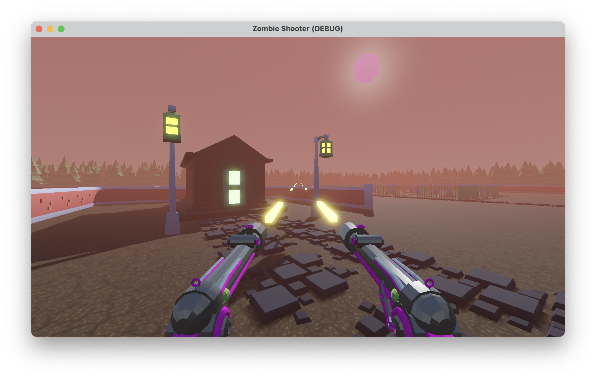
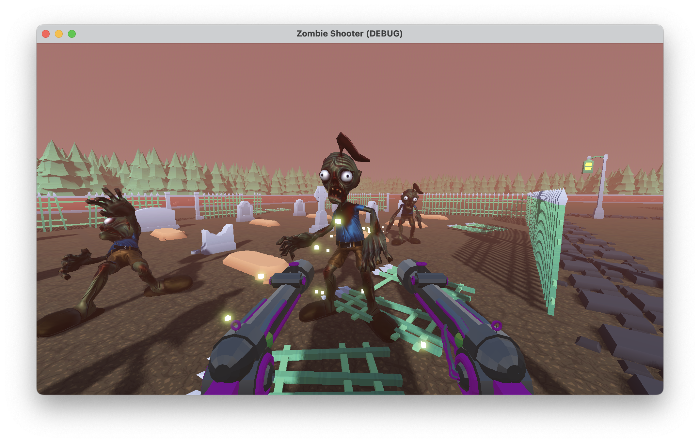
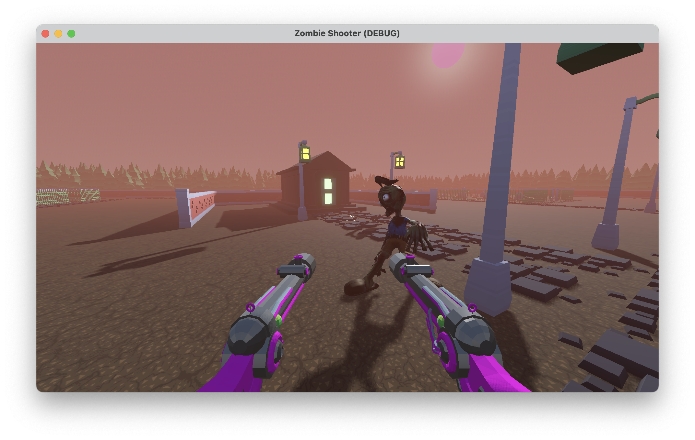

# Godot First Person Controller

A first-person shooter built in [Godot 4.4](https://godotengine.org/), following the [Godot University FPS tutorial](https://www.youtube.com/watch?v=A3HLeyaBCq4).

## Features

- First-person character controller
- Shooting mechanics with two guns
- Enemies with pathfinding
- Death animations

## Screenshots

| | |
|---|---|
|  |  |
|  | |

## Running

Open the project in Godot 4.4 and run the main scene.
